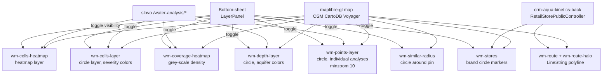

# Water-map design review · 2026-05-14

> **Назначение:** packaged review-doc для **claude design** (canvas в claude.ai). Содержит state of art фичи карты `/water` в prostor-app, скрины 17 сценариев на двух viewport'ах (desktop 1280, mobile 390), UX-вопросы для глубокого design review.
>
> **Дата:** 2026-05-14
> **Состояние карты:** все Phase 4.5 фронт-фичи + drilling USP-4 + real-estate multi + stores + route polyline. Backend закрыт (8 endpoints water-analysis + retail-stores public controller).
> **Связи:**
>
> - [water-map-thread.md](water-map-thread.md) — append-only лог обсуждения с slovo-claude (~30 итераций за неделю)
> - `slovo/docs/management/water-map-design-prompt.md` — оригинальный handoff promt v2 (555 строк)
> - `slovo/docs/features/prostor-water-pivot.md` — план фичи целиком
> - `slovo/prostor-heatmap-mobile-standalone.html` — первый прототип (Pencil bundler, 3 viewport)

---

## TL;DR

**Что построили:** карту-помощник для покупателя водоочистного оборудования. От «где у меня плохая вода» через «сколько стоит бурить» до «какой магазин Аквафор-Pro ближе всего» — всё на одной maplibre-карте с **15 504 анализами воды Подмосковья за 2020-2026 годы**.

**Уникальность:** ни у одного дилера в РФ нет open-доступного dataset'а такого scope с координатами + interval-first kNN прогнозами + cross-domain равлекцией каталога. **Не магазин с картой как декорация** — **карта-первое позиционирование**.

**4 USP:**

1. **kNN-прогноз химии для нового адреса БЕЗ анализа** (USP-1) — 22 параметра + interval P10-P90 + 4-level severity
2. **Cross-domain water → catalog** (USP-2) — per-problem search через 19 PROBLEM_TO_QUERY mapping → targeted рекомендации с reason
3. **Anomaly detection** (USP-3, backlog Tier 2) — z-score outliers
4. **Drilling-сегмент**: depth-map + aquifer-stats + depth-predict (USP-4) — B2B бурильщики/копатели/гидрогеологи/девелоперы

---

## Аудитория

| Persona                                             | Use-case                                                      | Главная фича                                                             |
| --------------------------------------------------- | ------------------------------------------------------------- | ------------------------------------------------------------------------ |
| **B2C новый клиент** (без анализа, без real-estate) | «Какая вода у меня в районе? Что покупать?»                   | RealEstatePicker / PinPlacementMode + risk heatmap + auto-equipment card |
| **B2C клиент с анализом**                           | «Мой анализ уже был — куда обратиться, что заказать»          | Точечные dots + PointPopup + CTA «Подобрать оборудование»                |
| **B2B бурильщик / гидрогеолог**                     | «Какая глубина бурения и какая там химия для нового участка?» | Depth-map + AquiferStatsModal + PredictDepthSection в predict-modal      |
| **Аналитика / маркетинг Аквафор**                   | «Где у нас данные есть/нет?»                                  | Coverage layer (grey-scale density), AquiferStatsModal с storytelling    |
| **Дилер Аквафор**                                   | «Куда направить клиента из своего района»                     | StorePopup + route polyline + availability badge                         |

---

## Архитектура слоёв карты



Backend контракты (slovo):

- `GET /water-analysis/heatmap?param=<23 paramCode>&west,south,east,north,grid` — cells агрегат
- `GET /water-analysis/predict?lat,lon,k,radiusKm` — kNN-прогноз химии (USP-1)
- `GET /water-analysis/depth-map?intakeType,bbox,grid` — карта глубин (USP-4)
- `GET /water-analysis/depth-predict?lat,lon,intakeType,k,radiusKm` — прогноз глубины
- `GET /water-analysis/points?bbox,limit` — individual анализы high-zoom
- `POST /water-analysis/equipment-suggest` body `{lat, lon, topK}` — cross-domain (USP-2)
- `GET /water-analysis/aquifer-stats?bbox,intakeType` — стратифицированная chemistry per layer
- `POST /water-analysis/heatmap/cell` body `{lat, lon, grid}` — детали ячейки для popup

---

## Полное описание фич (16 штук)

### 1. Heatmap качества воды (predator-stacked)

**Что:** 2-слойная композиция `wm-cells-heatmap` (smooth gradient blobs) + `wm-cells-layer` (точечные dots с severity-color поверх).

**Состояние:** scenarios `01-desktop-default-risk.png` + `02-mobile-default-risk.png`. По умолчанию `param='risk'`, оба слоя ON через `cellsViewMode='both'`.

**UX-фишки:**

- 4-level severity: safe (green-500) / borderline (yellow-500) / concerning (orange-500) / unsafe (red-500)
- `heatmap-weight: exceedsPct` (НЕ count) → Москва-центр не выглядит «грязнее» из-за density данных
- Baseline weight 0.15 — good cells видны как зелёный туман (юзер не путает «нет данных» с «всё в норме»)
- На zoom > 11 fade-out heatmap, fade-in dots, на zoom > 13 fade-in `points` layer (individual)

### 2. Param-pills + All-params modal

**Что:** 6 быстрых pills `[Индекс риска] [Все проблемы] [Железо] [Жёсткость] [Марганец] [Минерализация]` + кнопка «Все 22 параметра →» → modal с 22 параметрами разбитыми на 4 категории.

**Состояние:** `09-desktop-bottom-sheet-layers.png` (pills видны) + `10-desktop-all-params-modal.png` (modal раскрыт).

**Категории в modal:**

- 2 synthetic highlight-tiles сверху (Risk = composite 4 / Все проблемы = OR all regulated)
- **Органолептические** (3): запах, цвет, мутность
- **Обобщённые** (5): TDS, жёсткость, окисляемость, pH, щёлочность
- **Неорганические** (12): аммоний, железо, марганец, магний, кальций, нитраты, нитриты, сульфаты, сульфиды, хлориды, фториды, сероводород
- **Физические** (2): температура, электропроводность (не нормируются)

**Mobile:** modal full-screen (`h-[100dvh]`), не 85vh — exploration лучше.

### 3. ViewModeToggle (Сплайн / Точки / Оба)

**Что:** segmented radio в bottom-sheet под param-pills. Управляет visibility heatmap layer + dots layer независимо. Default `'both'`. Persist в `useWaterMapStore`.

**UX-логика:**

- **Сплайн** (heatmap only) — wow-режим для демо, smooth cinematic. Click handler не работает (heatmap не реагирует на point events).
- **Точки** (dots only) — analytical mode, точные клики, читается как scatter chart.
- **Оба** — рекомендованный default.

**Видно в:** `09-desktop-bottom-sheet-layers.png` (radio + emoji ✨ ● ◉).

### 4. SeverityLegend

**Что:** compact card в правом-нижнем углу карты с 4 цветными indicators + русскими labels. Collapsible через крестик → сворачивается в круглую «i» кнопку.

**Conditional rendering:**

- Показывается только когда `heatmap` toggle ON
- Если depth-map ON → стек: SeverityLegend ниже + AquiferLegend сверху

**Видно в:** `01-desktop-default-risk.png` правый-нижний угол, `04-desktop-coverage-only.png` (SeverityLegend скрыта — только Качество OFF).

### 5. Coverage layer (плотность архива)

**Что:** отдельный toggle «Покрытие архива · Плотность анализов — серая подложка поверх любого режима» в bottom-sheet. Grey-scale heatmap показывает где у нас сколько данных независимо от severity.

**Состояние:** `04-desktop-coverage-only.png` (Качество OFF, Coverage ON — чистая grey-scale карта).

**Смысл:** wow-аргумент «мы покрыли весь МО, не только Москву». 523 sparse (59%) + 215 medium (24%) + 148 dense (17%) cells, max 1817 анализов в одной cell (Москва).

### 6. Drilling depth-map + AquiferLegend

**Что:** `wm-depth-layer` показывает скважины/колодцы с цветом по dominantLayerId (5 aquifer-горизонтов МО):

| Layer                    | Цвет   | Глубина  |
| ------------------------ | ------ | -------- |
| 🟫 Верховодка            | brown  | 0-15м    |
| 🟩 Песчаный              | green  | 15-50м   |
| 🟦 Песчано-известняковый | cyan   | 50-100м  |
| 🔵 Известняковый         | blue   | 100-200м |
| 🟪 Артезианский          | purple | 200м+    |

**Состояние:** `05-desktop-drilling-depth-map.png` — Качество воды OFF, Глубина ON, AquiferLegend в углу.

**Conditional rendering:** AquiferLegend только при depthMap ON, иначе invisible.

### 7. AquiferStatsModal

**Что:** на тап «Тип воды в районе →» в bottom-sheet → modal с **стратифицированной chemistry per aquifer layer**.

**Состояние:** `06-desktop-aquifer-stats-modal.png` + `07-mobile-aquifer-stats-modal.png`.

**Содержимое:**

- Filter tabs (Все / Скважины / Колодцы) с persist
- Summary block: «8 231 анализ · 5 000 в подвыборке · преобладает Песчано-известняковый»
- 5 layer cards отсортированных по `minDepth` ascending (drilling storytelling):
    - Цветной dot + label + count + % bar + median depth + pctWell + grid top-3 chemistry (Fe / Жёсткость / Нитраты)
- Hint снизу: «Чем глубже бурение — тем стабильнее химия и меньше превышений ПДК»

**Storytelling insight visible:** Верховодка 0-15м `iron 0.100 nitrates 4.30` vs Песчано-известняковый 50-100м `iron 0.340 nitrates 2.00` — нитраты падают (surface contamination), железо растёт (глубокие горизонты железистые). **Не упрощённое «глубже = лучше»**.

### 8. PointPopup (на тапе individual анализа)

**Что:** на тапе по dot в `wm-points-layer` (zoom > 10) → modal с per-analysis breakdown.

**Состояние:** `08-desktop-point-popup.png` — клик по well_dug 9м risk 100.

**Содержимое:**

- **Title:** `«Колодец · 9 м · 15.06.2024»` (intakeLabel · depthLabel · sampleDate)
- **Header summary:** «5 проблем · 11 в норме · риск 100/100» с severity color
- **Секции по severity-priority (auto-expanded):**
    - 🔴 Превышение ПДК · N
    - 🟠 Возможно проблема · N
    - 🟡 На границе нормы · N
    - 🟢 В норме · N (collapsed)
    - ⚪ Справочно · N (collapsed, muted)
- **CTA «Подобрать оборудование под анализ»** (primary blue) — открывает EquipmentModal с координатами этой точки

### 9. CellPopup (на тапе heatmap cell)

**Что:** на тапе heatmap cell на zoom < 11 → BottomSheetModal с **cell-aggregated** breakdown через `/heatmap/cell` endpoint.

**Содержимое:**

- Header: «N анализов · M с проблемами · даты»
- TopProblems list (top-5 sorted by exceedsPct desc) с severity chip
- inNormParams list (collapsed)
- Edge cases: n=1 показывает «1 анализ — мало данных»
- Range ПДК для pH рендерится как «при ПДК 6-9»

### 10. RealEstatePicker (multi-pin)

**Что:** auth-only компонент в FTUX-блоке. Показывает список real-estate юзера из `/real-estate` endpoint.

**Состояние:** `11-desktop-authed-bottom-sheet.png` (видна секция «Ваше местоположение» + items).

**Содержимое:**

- TYPE_ICONS (HomeModernIcon / BuildingOffice2Icon / BuildingLibraryIcon) + label (Дом / Квартира / Промобъект)
- Address truncated
- Selected state: primary-tinted background + CheckCircleIcon справа
- Click → `setPin({ ..., source: 'real-estate', realEstateId })` → pin map'a follows
- Filter `coordinates !== null` — non-geocoded items скрыты

**Guest fallback:** auth-guard → null. Показывается только «Геолокация» + «На карте» row.

### 11. PinPlacementMode («На карте»)

**Что:** toggle «На карте» в FTUX (рядом с «Геолокация»). При активации → следующий click на map → `setPin({lat, lon, source: 'manual'})`. Cursor crosshair + banner overlay «Кликните на карте, чтобы поставить пин».

**Use-case:** гость без auth / клиент без real-estate / клиент хочет другую точку (не свой адрес).

**Видно в:** `11-desktop-authed-bottom-sheet.png` (button «На карте» в bottom-sheet).

### 12. Stores layer + StorePopup

**Что:** `wm-stores` source с brand-маркерами (white circle + green/amber по availability). Активируется в bottom-sheet «Точки продаж и приёма анализа».

**Состояние:** `13-desktop-stores-on-map-with-pin.png` (white dots на карте) + `14-desktop-store-popup.png` (popup на тапе).

**StorePopup содержит:**

- Title магазина + address + organizationName
- Availability badge (green «Полный ассортимент» / amber «Частичный ассортимент»)
- Duration (`1 ч 39 мин`) + distance (`124.5 км`)
- CTA «Построить маршрут» — toggle native polyline (см. фичу 13)

**Backend:** `GET /retail-stores/nearest?lat&lon&limit&cartItems` через `RetailStorePublicController` (crm-aqua-kinetics-back, БЕЗ AuthGuard для гостей).

### 13. Route polyline (native)

**Что:** на тапе «Построить маршрут» в StorePopup → создаётся `wm-route` source + 2 LineString layer (`wm-route-halo` 7px white + `wm-route-layer` 4px primary blue).

**Состояние:** `15-desktop-route-polyline.png` — синяя линия от Кашира pin → ФМ Выходной Люберцы store.

**Backend:** `GET /retail-stores/route-polyline?from=lng,lat&to=lng,lat` → OSRM-формат `{routes: [{geometry: {coordinates: [...]}}]}`.

**UX:**

- Toggle «Построить маршрут» / «Скрыть маршрут» в StorePopup
- Route рисуется НАД cells/coverage но ПОД stores/points (маркеры поверх)

### 14. AutoEquipmentCard

**Что:** floating card снизу карты которая **автоматически появляется** когда юзер ставит пин. Содержит: «По вашему адресу: 2 проблемы — 5 рекомендаций — тап для деталей».

**Состояние:** `13-desktop-stores-on-map-with-pin.png` + `15-desktop-route-polyline.png` (видна floating card сверху от bottom-nav).

**UX:**

- Auto-fetch `/water-analysis/equipment-suggest` при `setPin`
- Tap → открывает EquipmentModal с полным списком рекомендаций
- Dismiss-крестик помнит координаты в localStorage (toFixed(3) = 110м зона — micro-drag не reset'ит)

### 15. PredictModal

**Что:** на тапе FAB (после установки pin) → modal с **interval-first прогнозом химии воды**.

**Содержимое:**

- Header: nNeighbors / medianDistKm / pin address
- (Если есть скважины) `PredictDepthSection` — `<details open>` «⛏ Глубина бурения» с IntervalBarChart + layerDistribution + most-likely aquifer layer
- 5 byCategory секций (unsafe / concerning / borderline / safe / unmonitored) — sorted, expanded по severity
- Per param: IntervalBarChart 3-уровневый (hardRange / interval P10-P90 / IQR P25-P75 + pointEstimate marker), pdkStatus badge

### 16. EquipmentModal

**Что:** на тапе CTA в PredictModal / PointPopup / AutoEquipmentCard → modal с targeted рекомендациями.

**Содержимое:**

- Header: identified problems (sorted by severity) с reason
- Recommendations list: title / description / matchedProblem chip / reason / relevance score
- Backend: `POST /water-analysis/equipment-suggest` через per-problem search (19 PROBLEM_TO_QUERY mapping)

---

## Скрины — captions

| #   | Файл                                                                       | Что показано                                                                                                                                               |
| --- | -------------------------------------------------------------------------- | ---------------------------------------------------------------------------------------------------------------------------------------------------------- |
| 01  | `screenshots/review-2026-05-14/01-desktop-default-risk.png`                | Desktop default, risk pill, predator-stacked, full МО                                                                                                      |
| 02  | `screenshots/review-2026-05-14/02-mobile-default-risk.png`                 | Mobile 390×844 — full МО overview, predator + dots                                                                                                         |
| 03  | `screenshots/review-2026-05-14/03-desktop-all-problems-sheet-open.png`     | All_problems pill активен + bottom-sheet раскрыт                                                                                                           |
| 03b | `screenshots/review-2026-05-14/03b-desktop-all-problems-clean.png`         | All_problems без overlay'ев (карта чистая, виден severity legend)                                                                                          |
| 04  | `screenshots/review-2026-05-14/04-desktop-coverage-only.png`               | Coverage grey-scale solo, sidebar открыт                                                                                                                   |
| 05  | `screenshots/review-2026-05-14/05-desktop-drilling-depth-map.png`          | Depth-map ON, Качество OFF → AquiferLegend (5 цветов горизонтов)                                                                                           |
| 06  | `screenshots/review-2026-05-14/06-desktop-aquifer-stats-modal.png`         | AquiferStatsModal desktop: 5 layer cards + chemistry storytelling                                                                                          |
| 07  | `screenshots/review-2026-05-14/07-mobile-aquifer-stats-modal.png`          | AquiferStatsModal mobile full-screen — реальный insight «глубже = чище»                                                                                    |
| 08  | `screenshots/review-2026-05-14/08-desktop-point-popup.png`                 | PointPopup (Колодец 9м, risk 100, 5 проблем + severity sections)                                                                                           |
| 09  | `screenshots/review-2026-05-14/09-desktop-bottom-sheet-layers.png`         | Bottom-sheet полная структура: pills + ViewModeToggle + 4 layer toggles                                                                                    |
| 10  | `screenshots/review-2026-05-14/10-desktop-all-params-modal.png`            | Modal с 22 параметрами (2 synthetic highlights + 4 категории)                                                                                              |
| 11  | `screenshots/review-2026-05-14/11-desktop-authed-bottom-sheet.png`         | Authed bottom-sheet — секция «Ваше местоположение» + RealEstatePicker + 2-button row                                                                       |
| 12  | `screenshots/review-2026-05-14/12-desktop-real-estate-selected-stores.png` | Real-estate выбран (Кашира) + stores toggle activated (12 точек loaded)                                                                                    |
| 13  | `screenshots/review-2026-05-14/13-desktop-stores-on-map-with-pin.png`      | Pin на карте (Кашира) + россыпь stores markers + auto-equipment card                                                                                       |
| 14  | `screenshots/review-2026-05-14/14-desktop-store-popup.png`                 | StorePopup desktop (ФМ Выходной Люберцы, partial availability, 1ч 39мин)                                                                                   |
| 15  | `screenshots/review-2026-05-14/15-desktop-route-polyline.png`              | Native route polyline синяя линия Кашира → Люберцы                                                                                                         |
| 16  | `screenshots/review-2026-05-14/16-mobile-authed-sheet-real-estate.png`     | Mobile authed: StorePopup как bottom-sheet (full readability)                                                                                              |
| 17  | `screenshots/review-2026-05-14/17-mobile-authed-with-pin-stores.png`       | Mobile карта с pin + stores layer + auto-equipment card                                                                                                    |
| 18  | `screenshots/review-2026-05-14/18-mobile-bottom-sheet-layers.png`          | **Mobile** bottom-sheet полная структура (7 toggles + 6 pills + RealEstatePicker + ViewModeToggle + Аналитика по району) — самая нагруженная mobile-сценка |
| 19  | `screenshots/review-2026-05-14/19-mobile-all-params-modal.png`             | **Mobile** all-params modal full-screen (h-100dvh) — 22 параметра + 2 synthetic highlights + 4 категории                                                   |
| 20  | `screenshots/review-2026-05-14/20-mobile-coverage-only.png`                | **Mobile** Coverage solo (Качество OFF, Coverage ON) — серая подложка, чистый exploration                                                                  |
| 21  | `screenshots/review-2026-05-14/21-mobile-drilling-depth-map.png`           | **Mobile** Drilling depth-map ON, AquiferLegend в углу — B2B USP-4 на mobile                                                                               |
| 22  | `screenshots/review-2026-05-14/22-mobile-point-popup.png`                  | **Mobile** PointPopup (Скважина 86м, risk 100/100, 8 проблем = 4 превышение + 3 possible + 1 borderline + 6 норма) — bottom-sheet вариант                  |
| 23  | `screenshots/review-2026-05-14/23-mobile-store-popup.png`                  | **Mobile** StorePopup (ФМ Курс Ступино, 25 мин, 21.4 км, CTA «Построить маршрут») — bottom-sheet вариант                                                   |
| 24  | `screenshots/review-2026-05-14/24-mobile-route-polyline.png`               | **Mobile** Route polyline (Кашира → Ступино, синяя линия + bottom-sheet «Скрыть маршрут»)                                                                  |

**Mobile coverage: 11 из 24 скринов (46%)** — главный приоритет review. См. секции в PROMPT-файле.

---

## UX-вопросы для глубокого review

### Visual hierarchy

1. **Бэдж severity 4-level palette** — green/yellow/orange/red — достаточно контрастна для colorblind users (deuteranopia/protanopia)? Видно в `01`, `08`.
2. **Predator-stacked composition** — heatmap blob + circle dots поверх. На overview не теряются ли точки за blob'ом? `01` vs `04` (без blob'а).
3. **AquiferLegend vs SeverityLegend** в стеке (когда оба ON) — order правильный (drilling сверху)? `05` показывает только AquiferLegend.

### Information density

4. **PointPopup** (`08`) — 5 severity-секций + CTA + footer. Не перегружено? Sample показывает 100% risk → много red badges. Хороший visual rhythm?
5. **AquiferStatsModal mobile** (`07`) — 5 layer cards с chemistry grid (3 ключевых param) — достаточно или нужно больше per-layer?
6. **Bottom-sheet panel** (`09`, `11`) — 7+ toggle'ей + 6 pills + ViewModeToggle + RealEstatePicker (authed). Не overwhelming?
7. **Modal со всеми 22 параметрами** (`10`) — 2 highlight + 4 категории. Group ordering логичный? Где должна быть «Все проблемы» — рядом с Risk или ниже категорий?

### Empty states

8. **Default mobile** (`02`) — `Поставьте пин на свой адрес` card + 2 button row. Достаточно guidance для new user? Не залипает ли на «зачем мне это»?
9. **Coverage solo** (`04`) — без severity legend, юзер без context может не понять что значит «grey-scale». Нужен tooltip / legend для coverage отдельно?

### Color theory

10. **Aquifer palette** (5 цветов горизонтов: brown / green / cyan / blue / purple) vs **severity palette** (green / yellow / orange / red) — конфликтует? На скрине `05` видно одновременно green в depth (Песчаный) и green в severity. Юзер путается?
11. **Stores availability badge** — green «Полный» / amber «Частичный». Не семантический ли конфликт с severity green (норма) / amber (borderline)? `14`.

### Mobile-specific

12. **iPhone 14 Pro 390×844** — bottom-sheet не блокирует main map content? Когда открыт — карта тёмная, не понятно где pin. Лучше bottom-sheet 50% высоты или fully-modal?
13. **StorePopup mobile** (`16`) — bottom-sheet с store details + «Построить маршрут». Юзер видит магазин на карте после построения route? Если popup закрывает 60% screen — где юзер видит итог?

### Onboarding

14. **First-touch new user** (`02`) — приходит, не залогинен, видит карту с red blob, hint «поставьте пин», 2 кнопки. Какой первый action? Что мы хотим чтобы он сделал? Sequence?
15. **Authed first-touch** (`11`-`13`) — есть real-estate в Кашире. Должен ли pin **автоматически** устанавливаться на первый real-estate? Или ждём explicit click?

### Accessibility

16. **Touch targets** — все кнопки ≥ 44×44 (Apple HIG)? Особенно pills row, ViewModeToggle, real-estate items.
17. **Focus management** — после `setSelectedRouteTo([lon, lat])` куда уходит focus? Closing modal возвращает в правильное место?
18. **Aria labels** — header buttons имеют `aria-label`. У map controls (zoom in/out)?

### Performance / animation

19. **Layer transitions** — когда юзер toggle'ит heatmap OFF — есть smooth fade или instant hide? Должен быть smooth?
20. **Pin animation** — drop animation после `setPin`? Сейчас instant — может wow-эффект bouncing pin (как Google Maps)?

### Брендинг

21. **Капля + sparkle SVG** — на скринах не вижу как brand-mark. В первом FTUX «Использовать геолокацию» — там капля есть. Но на bottom-nav, header — где brand-mark? `02` (header в углу) vs `11` (header с user dot).
22. **OKLCH палитра прототипа** (`oklch(72% 0.16 232)` → `oklch(58% 0.22 258)` → `oklch(40% 0.26 270)`) — используется ли реально в gradients FAB / primary buttons?

---

## Что не трогать (constraints)

| Технология                   | Версия                                         | Причина не менять                                                                        |
| ---------------------------- | ---------------------------------------------- | ---------------------------------------------------------------------------------------- |
| **Next.js**                  | 16 (app router)                                | Базовый стек prostor-app                                                                 |
| **maplibre-gl-js**           | 5.20.1                                         | OSS, единственный production-ready map engine без vendor lock-in                         |
| **TanStack Query**           | 5.90                                           | API state management                                                                     |
| **daisyui + Tailwind**       | daisyui 5.5                                    | Design system constraint                                                                 |
| **FSD architecture**         | как сейчас                                     | Не предлагать atomic / clean / другие                                                    |
| **OSM CartoDB Voyager**      | base layer                                     | Без vendor lock-in (Mapbox / Google Maps отвергнуты)                                     |
| **OKLCH color space**        | в Pencil mockup'е был                          | Если предлагаешь редизайн палитры — стой в OKLCH, не HSL                                 |
| **Russian localization**     | основной язык                                  | Английского не предлагать                                                                |
| **Severity 4-level palette** | safe/borderline/concerning/unsafe              | Соответствует backend interval-first DTO, не менять количество уровней                   |
| **22 paramCode из СанПиН**   | + 3 synthetic (risk / all_problems / coverage) | Источник правды — `WATER_PARAMS_BY_CODE`, нельзя добавлять/убирать без backend изменений |

---

## Backlog (отложено, не предлагать)

| Фича                                             | Статус                              | Phase                      |
| ------------------------------------------------ | ----------------------------------- | -------------------------- |
| 3D extruded columns для depth-map                | drilling extras для wow-демо        | Phase 4.5.2                |
| Anomaly markers (z-score outliers)               | USP-3 backend Tier 2                | backend ещё нет endpoint'а |
| Performance smoke EXPLAIN ANALYZE                | hardening backend                   | low priority               |
| Mobile baseline weight visual review             | covered partially                   | минор                      |
| Time-series timeline (heatmap by year 2020-2026) | wow для исследовательских клиентов  | Phase 5+                   |
| Cell-popup screenshot validation                 | playwright не triggers maplibre tap | real-device тест           |

---

## Что ХОТИМ от claude design

🎨 **Главное: МНЕ НУЖНЫ HTML/CSS MOCKUPS В ARTIFACT'АХ, не только review текстом.** Сделай минимум **6 рендеримых artifact'ов** (Tailwind + daisyui подсветка ок) с альтернативами, которые я смогу drag'нуть назад на свою сторону.

### Minimum обязательных artifact'ов (НЕ negotiable):

1. **🎨 Mobile FTUX redesign** — gostевой first-touch (см. скрин `02-mobile-default-risk.png`). Сейчас 2 button row + hint card. Сделай 2-3 альтернативы в HTML artifact:
    - Variant A: gamified «3 step» onboarding (Step 1 — карта / Step 2 — pin / Step 3 — Что у меня)
    - Variant B: minimal-text «full immersion» — карта без overlay'ев + sticky CTA внизу
    - Variant C: «as is» refined — тот же layout но с лучшей typography / spacing

2. **🎨 BottomSheet IA alternative** — 7 toggle'ей + 6 pills (см. `09-desktop-bottom-sheet-layers.png` + `11-desktop-authed-bottom-sheet.png`). Перегружено? Покажи в HTML artifact'е:
    - 2 alternative layout'а с reorganization (например, tabs / accordion / collapsed-by-default secondary section)
    - Сохрани все 7 toggle'ей + 6 pills + RealEstatePicker — только reorganize visual hierarchy

3. **🎨 PointPopup typography & spacing refresh** — см. `08-desktop-point-popup.png`. Severity sections + 22 params + CTA. Сделай HTML artifact с:
    - Improved info density (collapsible secondary, более read'абельные severity badges)
    - Comparison side-by-side: current vs proposed
    - Highlight: где CTA, header summary, severity color rhythm

4. **🎨 StorePopup mobile-first** — `16-mobile-authed-sheet-real-estate.png`. Bottom-sheet с store details + route CTA. Сейчас закрывает 60% screen. HTML artifact с:
    - Mini-card variant (только сверху ~30% экрана, остальное map видно)
    - Tab-based variant («Магазин / Маршрут / Корзина» в одном popup'е)
    - Action-first variant («Построить маршрут» немедленно sticky на top)

5. **🎨 Wow-moment splash для demo** — splash-screen / loading state / pin drop animation / эффект при тапе на красную cell. HTML artifact с micro-interaction (CSS animation + minimal JS если нужно). 1-2 секунды wow на демо руководителю Аквафор.

6. **🎨 Color palette swatches** — visual palette (current 4-level severity + 5 aquifer + 2 availability + brand water-drop) как один artifact-swatch. Если найдёшь конфликт — предложи refresh **в OKLCH** с обоснованием. Не меняй semantic intent (red = unsafe, green = safe).

### Дополнительно (приоритет ниже, но welcome):

7. 📝 **Visual review per scenario** (text-only, не artifact) — пройди по 17 скринам, для каждого дать:
    - 3-5 bullet «работает»
    - 3-5 bullet «улучшить»
    - Mark scenarios где сделал artifact'ы выше (например «см. mockup #1 для альтернатив»)

8. 📝 **Information architecture proposal** — описание plus mermaid если хочешь user flow / navigation tree.

9. 📝 **Accessibility audit** — touch targets, contrast ratios (особенно severity green vs aquifer green), focus management.

### Формат artifact'ов

- **HTML+Tailwind** (CDN OK для preview, не обязательна daisyui — мы её сами адаптируем)
- **Self-contained** — один artifact = один scenario, можно drag'нуть в codebase
- **Mobile-first** где scenario mobile — viewport meta + 390px width container
- **Comments в HTML** — где какая mockup-variant, как читать
- **Without lorem ipsum** — используй реальные данные с скринов (Кашира, ФМ Выходной Люберцы, 12 точек, нитриты 4.3 и т.д.)

### Что НЕ нужно:

- Не менять technical stack (Next.js + maplibre + daisyui — fixed)
- Не предлагать new colors palette без OKLCH (если refresh — сразу в OKLCH с обоснованием)
- Не trog'ать backend контракты (то что в скринах — что есть)
- Не предлагать удалять фичи (можно reorganize, нельзя remove)
- Не использовать React в artifact'ах — pure HTML+CSS. Component'ы я сам адаптирую

---

## Готовый prompt для claude design (copy-paste)

```
Привет! Это design review карты `/water` в PROSTOR — водо-aware приложение Аквафор-Pro.
Мы построили карту-помощник для покупателя водоочистного оборудования (B2C + B2B drilling).
15 504 анализа воды Подмосковья за 2020-2026, kNN-прогнозы по координатам, drilling-stats,
точки продаж + native polyline route. 16 фич на одной maplibre-карте.

Полный контекст + 17 скринов + UX-вопросы + constraints — в прикреплённом markdown.
Скрины: desktop 1280 и mobile 390 (iPhone 14 Pro target).

⚠️ ГЛАВНОЕ: мне нужны HTML/CSS MOCKUPS В ARTIFACT'АХ, не только review текстом.
Минимум 6 рендеримых artifact'ов с альтернативами:

1. 🎨 Mobile FTUX redesign — 3 variants для гостевого first-touch (scenario 02)
2. 🎨 BottomSheet IA — 2 variants reorganization без удаления фич (scenarios 09 + 11)
3. 🎨 PointPopup refresh — typography/spacing/info density (scenario 08)
4. 🎨 StorePopup mobile-first — 2-3 variants без перекрытия 60% screen (scenarios 16, 17)
5. 🎨 Wow-moment splash/animation для demo (1-2 sec wow для руководителя Аквафор)
6. 🎨 Color palette swatches — OKLCH refresh если найдёшь конфликт severity vs aquifer

Формат artifact'ов:
- HTML + Tailwind (CDN OK)
- Pure HTML, без React
- Mobile-first где scenario mobile (viewport 390px)
- Real data из скринов (не lorem ipsum) — Кашира, ФМ Выходной Люберцы, нитриты 4.3, etc.
- Comments в HTML где какая variant

Дополнительно (text-only):
7. Visual review per scenario (3-5 bullets «работает» + «улучшить»)
8. Information architecture proposal — 16 фич не overload ли?
9. Accessibility audit — touch targets, contrast ratios

Stack constraints (НЕ трогать): Next.js 16 + maplibre-gl 5.20 + daisyui + TanStack Query.
Без vendor map providers (Mapbox/Google), без translation, OKLCH palette.
Backend контракты fixed (см. markdown секцию «Архитектура»).

Начинай со scenario 02 (Mobile default first-touch) — сразу с artifact #1 (Mobile FTUX).
По очереди: artifact → краткий review текстом → next artifact.
```

Этот prompt + текущий MD + 17 скринов drag-drop'ом в чат claude design.

---

## Что дальше

Ожидаем от claude design batch'ем (1 chat session или несколько):

1. **Visual review** per scenario (15-20 min review work)
2. **2-3 micro-mockups** с альтернативами (например, alternative onboarding или color refresh)
3. **Information architecture proposal** если 16 фич реально overload

После — `prostor-claude` берёт actionable items в work через thread, я делаю backend changes если нужно.
